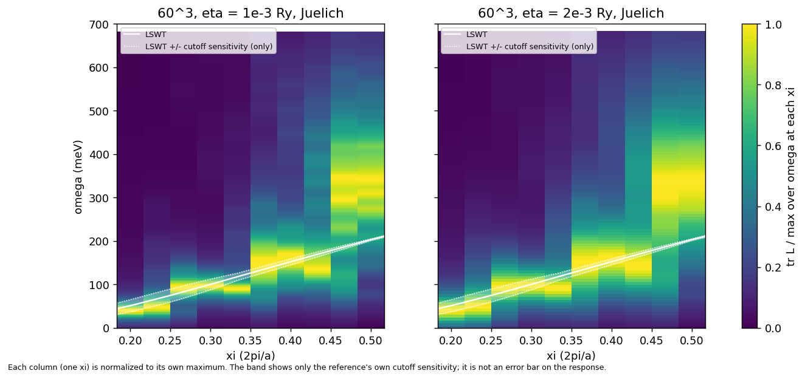

# VAL-18: spin response on bcc Fe, 60³ scans against the LKAG + LSWT reference

Transverse spin response, Juelich amplitudes, bcc Fe (`tests/spin_response/fe_bcc`), q along Γ–H, direct (ξ/2, −ξ/2, ξ/2) with ξ = n/30, n = 6..15 (t = n/60 on a 60³ mesh, every k+q a mesh point). Reference: `tests/spin_response/oracles/fe_lswt.dat`. Tolerances and regions: `tests/spin_response/oracles/tolerances.nml` and the spec's "LKAG + LSWT comparison".

The 24³ baseline in `tests/spin_response/baseline/` (η = 2e-3, 101 points, ξ = 0.25, 1/3, 0.5) is a reproduction snapshot of the code's own output, not converged physics; the table below comes from the 60³ scans.

## Inputs

| Item | Value |
| --- | --- |
| Mesh | 60 × 60 × 60, full BZ |
| E_F input, E_F used, electron count | −0.067656 Ry, −0.06879051 Ry, 7.99999999985 |
| U_Juelich, U_Mills (band centres) | 0.07618994 Ry, 0.0703611 Ry |
| Window, points, spacing at η = 1e-3 | 0 to 0.05 Ry, 201, 2.5e-4 Ry |
| Window, points, spacing at η = 2e-3 | 0 to 0.05 Ry, 101, 5e-4 Ry |
| Binary | Release build of the `5430499` source, plus scratch hooks not in the tree (`SR_U_SCALE`, electron-count bypass, `SR_COEF_GOLDSTONE`); none is active in the Juelich scans |
| Wall time | η = 1e-3: 629 s per process (two q each, ten processes on 8 cores); η = 2e-3: 377 s per process (five processes) |

## Results

The region tolerances were set after the scans, from measurements independent of the comparison (the J(r) cutoff study and the projector scan).

Dominant peak = highest interior local maximum of tr L in the window (parabolic refinement). Deviation = (peak − LSWT)/LSWT. LSWT values marked * are a cubic through the four nearest rows of `fe_lswt.dat`; the others are rows of the file. Region I: ξ ≤ 0.25, tolerance `region1_rel` = 0.35. Region II: 0.25 < ξ < 0.45, tolerance `region2_rel` = 0.25. Region III: ξ ≥ 0.45, the LSWT energy lies in the contiguous interval around the dominant peak where tr L is at least half its height (interval edges given).

| ξ | LSWT (meV) | peak η 1e-3 (meV) | peak η 2e-3 (meV) | region | criterion | deviation η 1e-3 / 2e-3 | tolerance | within tolerance η 1e-3 / 2e-3 |
|---|---|---|---|---|---|---|---|---|
| 0.2000 | 51.0 | 38.9 | 40.2 | I | region1_rel | -0.237 / -0.211 | 0.35 | yes / yes |
| 0.2333 | 66.5* | 47.6 | 48.7 | I | region1_rel | -0.284 / -0.267 | 0.35 | yes / yes |
| 0.2667 | 83.0* | 92.4 | 94.1 | II | region2_rel | +0.114 / +0.134 | 0.25 | yes / yes |
| 0.3000 | 100.1 | 96.5 | 97.0 | II | region2_rel | -0.036 / -0.031 | 0.25 | yes / yes |
| 0.3333 | 117.6* | 89.8 | 91.0 | II | region2_rel | -0.236 / -0.226 | 0.25 | yes / yes |
| 0.3667 | 135.0* | 145.2 | 149.0 | II | region2_rel | +0.076 / +0.104 | 0.25 | yes / yes |
| 0.4000 | 152.2 | 167.8 | 160.2 | II | region2_rel | +0.103 / +0.052 | 0.25 | yes / yes |
| 0.4333 | 169.3* | 135.3 | 141.7 | II | region2_rel | -0.201 / -0.163 | 0.25 | yes / yes |
| 0.4667 | 186.4* | 346.3 | 338.0 | III | half-maximum span | span 160-482 meV / span 82-497 meV | n/a | yes / yes |
| 0.5000 | 203.1 | 342.0 | 339.1 | III | half-maximum span | span 191-469 meV / span 181-492 meV | n/a | yes / yes |

## Projector sensitivity

Same 60³ scan at η = 1e-3 with the coefficient amplitudes and U from the Goldstone condition on their own static χ⁰ and moments (`coefficient_goldstone.patch`); U = 0.0819387 Ry.

| ξ | Juelich peak (meV) | coefficient peak (meV) | shift (meV) | shift (%) |
|---|---|---|---|---|
| 0.2000 | 38.9 | 31.7 | -7.3 | -18.7 |
| 0.2333 | 47.6 | 37.0 | -10.6 | -22.2 |
| 0.2667 | 92.4 | 81.3 | -11.1 | -12.0 |
| 0.3000 | 96.5 | 81.8 | -14.7 | -15.2 |
| 0.3333 | 89.8 | 78.6 | -11.3 | -12.6 |
| 0.3667 | 145.2 | 123.5 | -21.8 | -15.0 |
| 0.4000 | 167.8 | 137.7 | -30.2 | -18.0 |
| 0.4333 | 135.3 | 119.4 | -15.9 | -11.7 |
| 0.4667 | 346.3 | 288.9 | -57.4 | -16.6 |
| 0.5000 | 342.0 | 265.1 | -76.9 | -22.5 |

Shift: mean −16.4 %, range −22.5 % to −11.7 %.

## Intensity map



tr L(ξ, ω) at η = 1e-3 (left) and η = 2e-3 (right), Juelich, 60³, each ξ column divided by its own maximum. White line: LSWT. Dotted lines: LSWT × (1 ± s(ξ)) with s the J(r) cutoff sensitivity from the `fe_lswt.dat` header, interpolated linearly between its listed ξ. The band shows only the reference's cutoff sensitivity.

## Commands

Work directory: any empty directory (`runs/` is created in it). `S=tests/validation/spin_response_stage2`, `BIN` the Release `rslmto.x`, `PBIN` a binary built from the source with `coefficient_goldstone.patch` applied (`git apply -p1`).

```
for each pair of ξ in (0.2, 0.23333333333333334), (0.26666666666666666, 0.3), (0.3333333333333333, 0.36666666666666664),
                      (0.4, 0.43333333333333335), (0.4666666666666667, 0.5), with i = 0..4:
  python3 $S/run_sr2.py 60 1e-3 <xi1>,<xi2> --bin $BIN --tag _s1a<i>
  python3 $S/run_sr2.py 60 2e-3 <xi1>,<xi2> --bin $BIN --tag _r4a<i>
  python3 $S/run_sr2.py 60 1e-3 <xi1>,<xi2> --bin $PBIN --tag _s2a<i> --method mills --env SR_COEF_GOLDSTONE=1
python3 $S/val18_table.py     # the results table above
python3 $S/plots4.py          # intensity_map.png, xi_scan_r4.png
```

`run_sr2.py` copies `tests/spin_response/fe_bcc`, sets `nk1 = nk2 = nk3 = 60`, `post_processing = 'spin_response'` and appends the `&spin_response` block (`method`, `q_list`, `omega_min = 0`, `omega_max = 0.05`, `n_omega`, `eta`). The eta = 2e-3 spacing is the largest allowed by eta/4.
